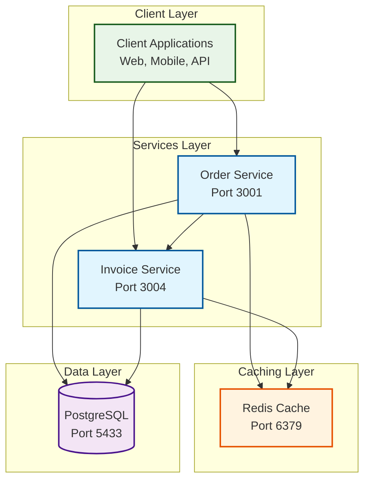
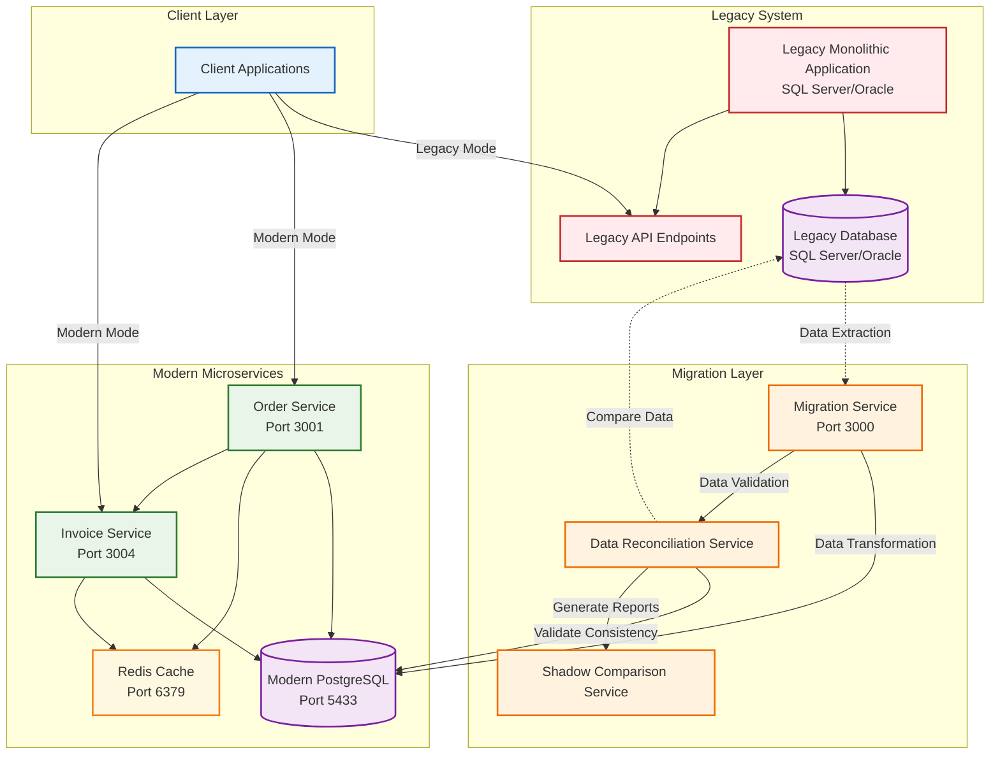
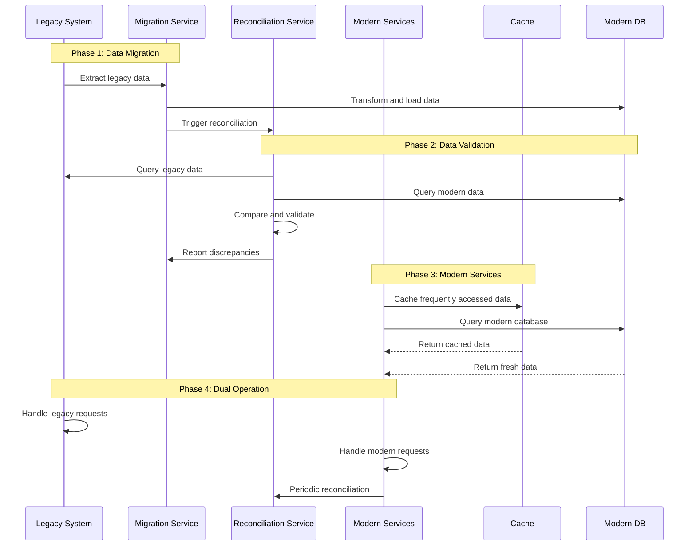
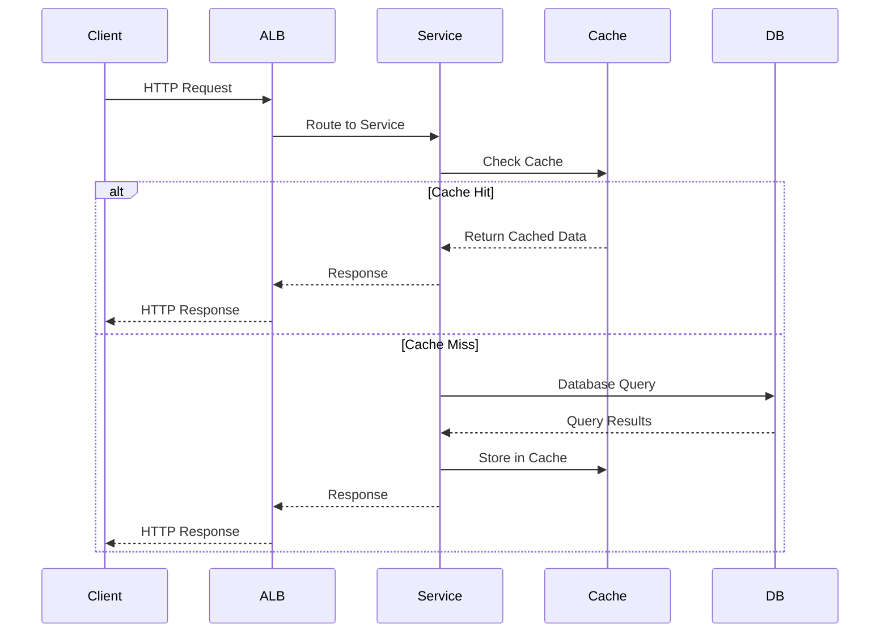
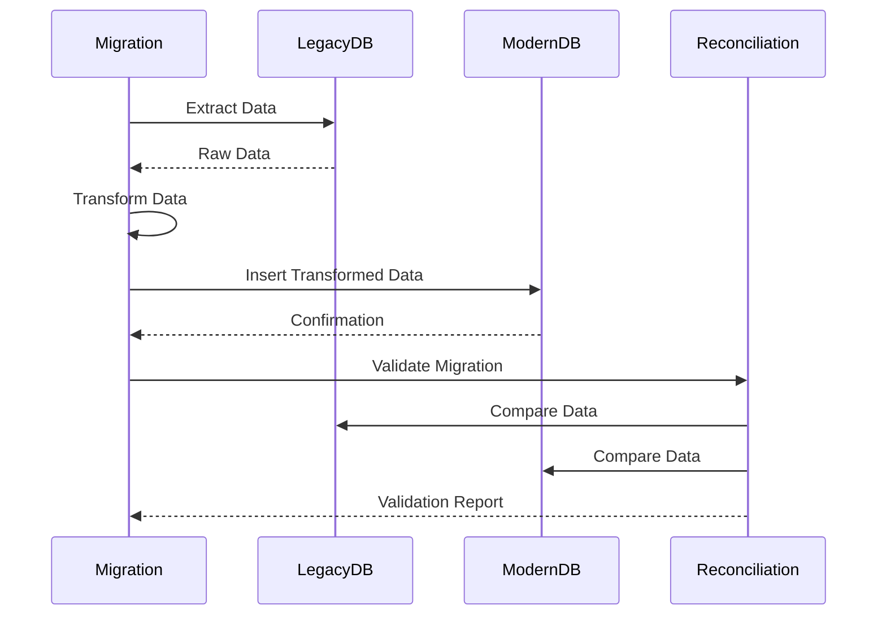

# 🏗️ **System Architecture**

## **High-Level Architecture Diagram**



## **Legacy to Modern Services Migration Architecture**



## **Migration Communication Patterns**



## **Detailed Component Architecture**

### **1. API Gateway Layer**
- **AWS Application Load Balancer (ALB)**
  - Routes traffic to microservices
  - Health checks and auto-scaling
  - SSL termination
  - Path-based routing

- **AWS API Gateway**
  - RESTful API management
  - Rate limiting and throttling
  - API versioning
  - Request/response transformation

### **2. Microservices Layer**

#### **Order Service (Port 3001)**
```
┌─────────────────────────────────────┐
│           Order Service             │
├─────────────────────────────────────┤
│  Controllers                        │
│  ├── OrdersController               │
│  └── CustomersController            │
├─────────────────────────────────────┤
│  Services                           │
│  ├── OrdersService                  │
│  └── CustomersService               │
├─────────────────────────────────────┤
│  Repositories                       │
│  ├── OrderRepository                │
│  └── CustomerRepository             │
├─────────────────────────────────────┤
│  External Dependencies              │
│  ├── Prisma ORM                     │
│  ├── Redis Cache                    │
│  └── PostgreSQL                     │
└─────────────────────────────────────┘
```

#### **Invoice Service (Port 3004)**
```
┌─────────────────────────────────────┐
│          Invoice Service            │
├─────────────────────────────────────┤
│  Controllers                        │
│  └── InvoicesController             │
├─────────────────────────────────────┤
│  Services                           │
│  ├── InvoicesService                │
│  └── OrderApiService (External)     │
├─────────────────────────────────────┤
│  Repositories                       │
│  └── InvoiceRepository              │
├─────────────────────────────────────┤
│  External Dependencies              │
│  ├── Prisma ORM                     │
│  ├── Redis Cache                    │
│  ├── PostgreSQL                     │
│  └── Order Service API              │
└─────────────────────────────────────┘
```

#### **Migration Service (Port 3000)**
```
┌─────────────────────────────────────┐
│         Migration Service           │
├─────────────────────────────────────┤
│  Controllers                        │
│  ├── MigrationController            │
│  └── ReconciliationController       │
├─────────────────────────────────────┤
│  Services                           │
│  ├── MigrationService               │
│  ├── DataReconciliationService      │
│  └── ReconciliationService          │
├─────────────────────────────────────┤
│  External Dependencies              │
│  ├── Prisma ORM                     │
│  ├── Legacy Database Connector      │
│  └── PostgreSQL                     │
└─────────────────────────────────────┘
```

### **3. Caching Architecture**

#### **Multi-Layer Caching Strategy**
```
┌─────────────────────────────────────┐
│           Client Request            │
└─────────────┬───────────────────────┘
              │
┌─────────────▼───────────────────────┐
│         API Gateway                 │
│      (Response Caching)             │
└─────────────┬───────────────────────┘
              │
┌─────────────▼───────────────────────┐
│        Microservice                 │
│    (@Cacheable Decorator)           │
└─────────────┬───────────────────────┘
              │
    ┌─────────┴─────────┐
    │                   │
┌───▼────┐         ┌───▼────┐
│ Redis  │         │Memory  │
│ Cache  │         │Cache   │
│(Primary│         │(Fallback│
│ Layer) │         │ Layer) │
└────────┘         └────────┘
    │                   │
    └─────────┬─────────┘
              │
┌─────────────▼───────────────────────┐
│        PostgreSQL                   │
│      (Database Layer)               │
└─────────────────────────────────────┘
```

### **4. Data Flow Architecture**

#### **Request Flow**


#### **Migration Flow**


## **Technology Stack**

### **Backend Services**
- **Framework**: NestJS (Node.js)
- **Language**: TypeScript
- **ORM**: Prisma
- **Database**: PostgreSQL 15
- **Cache**: Redis 7
- **API Documentation**: Swagger/OpenAPI

### **Infrastructure**
- **Containerization**: Docker
- **Orchestration**: Amazon ECS
- **Load Balancer**: AWS Application Load Balancer
- **API Gateway**: AWS API Gateway
- **Infrastructure as Code**: AWS CloudFormation
- **Container Registry**: Amazon ECR

### **Monitoring & Observability**
- **Logging**: AWS CloudWatch Logs
- **Metrics**: AWS CloudWatch Metrics
- **Tracing**: AWS X-Ray
- **Health Checks**: Custom health endpoints

### **Development & Deployment**
- **Version Control**: Git
- **CI/CD**: GitHub Actions (planned)
- **Local Development**: Docker Compose
- **Testing**: Jest, Supertest
- **Code Quality**: ESLint, Prettier

## **Security Architecture**

### **Network Security**
- **VPC**: Isolated network environment
- **Security Groups**: Firewall rules for service communication
- **Private Subnets**: Database and cache in private networks
- **NAT Gateway**: Outbound internet access for private resources

### **Application Security**
- **HTTPS**: TLS encryption for all communications
- **API Authentication**: JWT tokens (planned)
- **Input Validation**: Class-validator decorators
- **SQL Injection Prevention**: Prisma ORM parameterized queries

### **Data Security**
- **Encryption at Rest**: AWS RDS encryption
- **Encryption in Transit**: TLS for all connections
- **Secrets Management**: AWS Secrets Manager
- **Database Access**: IAM roles and policies

## **Scalability Architecture**

### **Horizontal Scaling**
- **Auto Scaling Groups**: ECS service auto-scaling
- **Load Distribution**: ALB with multiple targets
- **Stateless Services**: No session affinity required
- **Database Connection Pooling**: Prisma connection management

### **Vertical Scaling**
- **Resource Allocation**: CPU and memory optimization
- **Container Sizing**: Right-sized ECS task definitions
- **Database Scaling**: RDS instance scaling options

### **Performance Optimization**
- **Caching Strategy**: Multi-layer caching with Redis
- **Database Indexing**: Optimized Prisma queries
- **CDN Integration**: CloudFront for static assets (planned)
- **Connection Pooling**: Efficient database connections

## **Deployment Architecture**

### **Environment Separation**
```
┌─────────────────────────────────────┐
│           Production                │
│  ┌─────────┐  ┌─────────┐          │
│  │   ECS   │  │   RDS   │          │
│  │Services │  │PostgreSQL│         │
│  └─────────┘  └─────────┘          │
└─────────────────────────────────────┘

┌─────────────────────────────────────┐
│            Staging                  │
│  ┌─────────┐  ┌─────────┐          │
│  │   ECS   │  │   RDS   │          │
│  │Services │  │PostgreSQL│         │
│  └─────────┘  └─────────┘          │
└─────────────────────────────────────┘

┌─────────────────────────────────────┐
│           Development               │
│  ┌─────────┐  ┌─────────┐          │
│  │ Docker  │  │ Docker  │          │
│  │Compose  │  │PostgreSQL│         │
│  └─────────┘  └─────────┘          │
└─────────────────────────────────────┘
```

### **CI/CD Pipeline** (Planned)


This architecture provides a robust, scalable, and maintainable foundation for the modernized Order Management System with clear separation of concerns, comprehensive caching, and cloud-native deployment capabilities.
